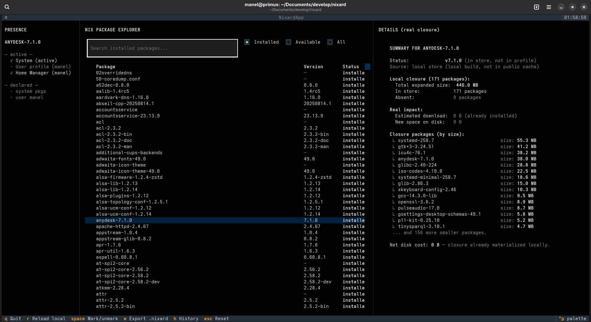

# nixard

A powerful terminal UI for exploring NixOS packages, inspecting real dependency closures, auditing system/package presence, and generating ready-to-use Nix configurations.



---

# What is nixard?

`nixard` is an interactive Textual-based TUI for NixOS and Nix users.

It combines:

- package exploration
- real closure analysis
- local store auditing
- configuration inspection
- export/history management
- and direct `.nix` editing

…inside a single keyboard-driven interface.

Unlike traditional Nix tools, `nixard` focuses on **real-world impact**:

- what is already installed
- what is merely present in the store
- what is garbage-collectable
- what actually needs downloading
- how much disk space a package will truly consume
- where packages are declared across your system

---

# Features

## Package exploration

- Browse installed packages interactively
- Search available packages from nixpkgs / `cache.nixos.org`
- Fast keyboard-driven workflow
- Multi-scope package visibility

---

## Real closure analysis

`nixard` performs real dependency closure inspection using:

- local `/nix/store`
- active profiles
- recursive `.narinfo` crawling from `cache.nixos.org`

It distinguishes between:

- already active packages
- locally cached packages
- garbage-collectable paths
- fully missing dependencies

and calculates:

- real download size
- expanded disk usage
- incremental closure impact

No builds are performed.

---

## NixOS configuration awareness

Automatically detects and analyzes:

- `configuration.nix`
- flakes
- Home Manager setups
- user profiles
- system generations

Supported scopes include:

| Scope | Meaning |
|---|---|
| `System (active)` | Current running system generation |
| `User profile (user)` | Packages installed via `nix profile` |
| `Home Manager (user)` | Home Manager-managed packages |
| `Config: system pkgs` | Declared in `environment.systemPackages` |
| `Config: user <name>` | Declared in `users.users.<name>.packages` |

Flake-based systems are detected automatically.

---

## Marking & exporting packages

Mark packages interactively and export them as `.nixard` files.

Exports include ready-to-use snippets for:

- `environment.systemPackages`
- `home.packages`
- `nix-shell`
- `nix profile install`

Example:

```nix
environment.systemPackages = with pkgs; [
  ripgrep
  fd
  bat
];
```

---

## Persistent export history

`nixard` stores export history automatically.

You can:

- restore previous selections
- extend existing exports
- re-export package sets
- manage historical package groups

History survives across sessions.

---

## Integrated `.nix` editor

One of the major features of `nixard` is its built-in split editor.

The editor provides:

- `.nixard` reference panel
- direct `.nix` file editing
- automatic `.nixard-backup` creation
- inline sudo authentication
- safe editing workflow

Supported discovery locations include:

- `/etc/nixos`
- Home Manager directories
- flake directories
- user nixpkgs configs

This allows editing live NixOS configurations without leaving the TUI.

---

# Installation

## Run instantly

```bash
nix run github:manelinux/nixard
```

Or enter a temporary shell:

```bash
nix shell github:manelinux/nixard
```

---

## Permanent install

### Flake / profile install

```bash
nix profile install github:manelinux/nixard
```

### Legacy install

```bash
git clone https://github.com/manelinux/nixard.git
cd nixard
nix-env -i -f .
```

---

# Usage

Launch:

```bash
nixard
```

Everything is keyboard-driven.

---

# Key bindings

| Key | Action |
|---|---|
| `↑ ↓` | Navigate packages |
| `Enter` | Inspect selected package |
| `Space` | Mark/unmark package |
| `e` | Export marked packages |
| `n` | Open integrated `.nix` editor |
| `h` | Open export history |
| `r` | Reload local system data |
| `Esc` | Reset interface |
| `q` | Quit |

---

# How closure analysis works

`nixard` combines multiple strategies:

- `nix path-info`
- `nix show-derivation`
- `nix-store -qR`
- direct `.narinfo` inspection
- recursive dependency crawling
- local store inspection

The resulting dependency graph is compared against your real system state to estimate:

- additional download size
- unpacked closure size
- dependency reuse

This provides much more realistic installation estimates than standard Nix tooling.

---

# Safety

`nixard`:

- does not modify your system automatically
- performs no builds during inspection
- creates backups before editing protected `.nix` files
- uses explicit save actions
- isolates editing from export generation

---

# Requirements

- Linux
- Nix or NixOS
- Python 3
- `textual`
- Internet access to `cache.nixos.org`
- `nix-command flakes` recommended

---

# Roadmap

Planned / possible future features:

- dependency tree visualization
- generation diffing
- dead package detection
- side-by-side package comparison
- local narinfo cache
- `--json` API mode
- dependency heatmaps
- rebuild impact preview
- package graph visualization

---

# Contributing

Pull requests, ideas and issues are welcome.

---

# License

MIT
